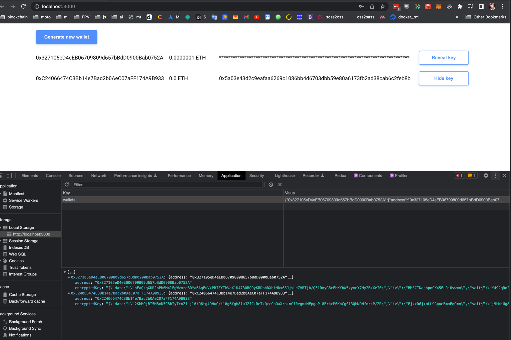
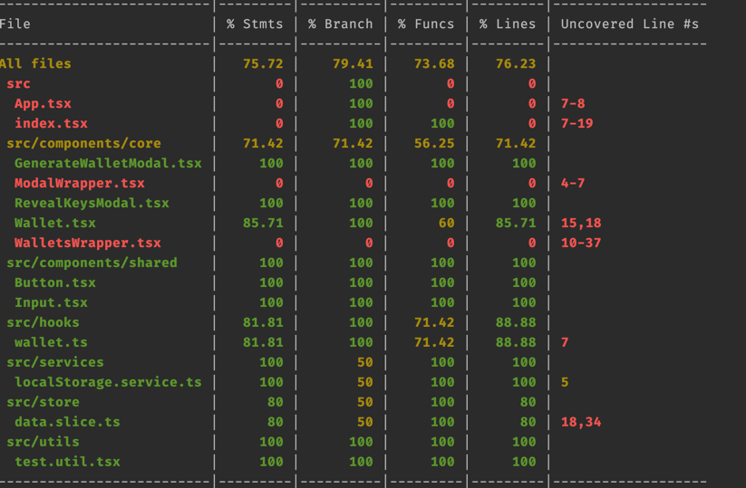

# [Front] Simple Wallet Keeper

### This assignment is to build a small frontend that stores user’s wallets securely.

## Task

Your task is to create a simple website that allow users to generate, store and fetch wallets.

**User’s requirements**

- Users would like to click a button to generate a Wallet.
- Users would like to see a list of generated wallets.
- Users would like to see their private keys by entering their password.
- Users would like to see their balance in testnet networks

**Key points:**

- Wallets should be compatible with EVM networks such as **BNB Chain** or **Ethereum**
- You can store the list of wallets in local storage.
- You should NOT store user’s passwords.
- You should NOT store user’s private keys in plaintext.

### What we would like to see

- Testing.
- Use of React hooks.
- State management.
- Architecture considerations.
- Simplicity.

### Considerations

- We will not focus on design or UI.
- You can use Next.js or create-react-app to bootstrap your solution.
- You can use Redux
- You cannot use a UI kit.

---

### Some notes:

when the user generates a new wallet this wallet will be added to the state and at the same time stored to localstorage as object `{address: {address, encryptedKey} }`. By requirements, i can't save the password, and private key as plain text, so i decided to store encrypted key, if the user wants to reveal the key he should decrypt it via password. i used the browser-passworder library for decryption (to be honest i checked that metamask also uses this library, but they forked it because it was updated last time many years ago)

i save decrypted key in store because i need it to pass between components (Wallet and RevealKeyModal), another option to do that without storing - use callback but in this case probably we will have problems with testing

you can see notice in console and in tests, this is because i use ethers formatter without API keys

- make sense to create one modal and pass handlers and some logic by props to avoid code duplicates, but yous asked simplicity
- probably is not the best option to create modals via wrapper, i could use portals for example. but in case with wrapper i can demonstrate how i work with 2 states in one app, usually i prefer to split state to 2 parts - data from API and app state
- i covered most critical logic and skipped simple render (eg WalletsList, ModalWrapper components)  

--- 

# Getting Started with Create React App

This project was bootstrapped with [Create React App](https://github.com/facebook/create-react-app).

## Available Scripts

In the project directory, you can run:

### `npm start`

Runs the app in the development mode.\
Open [http://localhost:3000](http://localhost:3000) to view it in the browser.

The page will reload if you make edits.\
You will also see any lint errors in the console.

### `npm test`

Launches the test runner in the interactive watch mode.\
See the section about [running tests](https://facebook.github.io/create-react-app/docs/running-tests) for more information.

### `npm run build`

Builds the app for production to the `build` folder.\
It correctly bundles React in production mode and optimizes the build for the best performance.

The build is minified and the filenames include the hashes.\
Your app is ready to be deployed!

See the section about [deployment](https://facebook.github.io/create-react-app/docs/deployment) for more information.

### `npm run eject`

**Note: this is a one-way operation. Once you `eject`, you can’t go back!**

If you aren’t satisfied with the build tool and configuration choices, you can `eject` at any time. This command will remove the single build dependency from your project.

Instead, it will copy all the configuration files and the transitive dependencies (webpack, Babel, ESLint, etc) right into your project so you have full control over them. All of the commands except `eject` will still work, but they will point to the copied scripts so you can tweak them. At this point you’re on your own.

You don’t have to ever use `eject`. The curated feature set is suitable for small and middle deployments, and you shouldn’t feel obligated to use this feature. However we understand that this tool wouldn’t be useful if you couldn’t customize it when you are ready for it.

## Learn More

You can learn more in the [Create React App documentation](https://facebook.github.io/create-react-app/docs/getting-started).

To learn React, check out the [React documentation](https://reactjs.org/).
